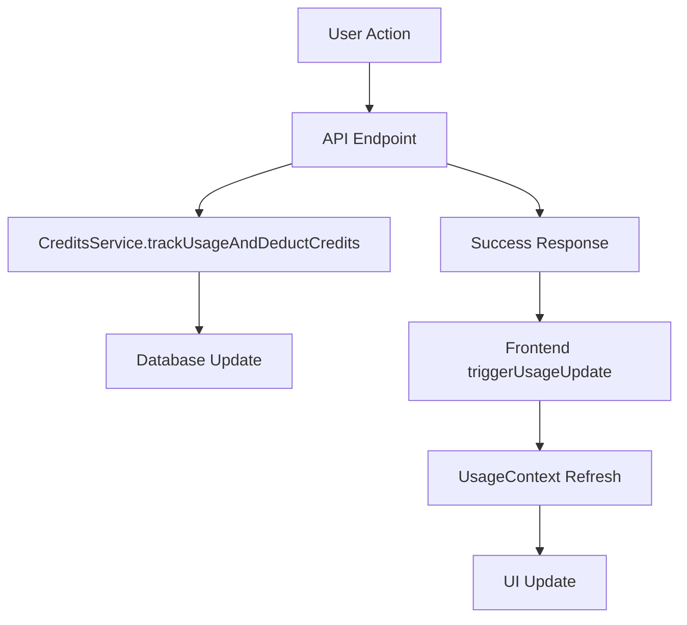

# Real-Time Credit System Implementation Guide

## Overview

This document provides a complete guide for implementing and integrating the real-time credit system with new features. The system eliminates wasteful polling and provides immediate feedback when credits are consumed.

## Architecture

### Core Components



### Key Files

- **Context**: `src/contexts/usage-context.tsx` - Central state management
- **Component**: `src/components/ui/usage-tracker.tsx` - UI display
- **Service**: `src/lib/credits-service.ts` - Backend credit operations
- **API**: `src/app/api/usage/stats/route.ts` - Usage stats endpoint

## Implementation Steps

### 1. Frontend Integration

#### Add Usage Context to Components

```typescript
import { useUsage } from "@/contexts/usage-context";

export function YourComponent() {
  const { triggerUsageUpdate } = useUsage();
  
  // Your component logic
}
```

#### Trigger Updates After Credit-Consuming Actions

```typescript
const handleCreditConsumingAction = async () => {
  try {
    // Make API call that consumes credits
    const response = await fetch("/api/your-endpoint", {
      method: "POST",
      headers: {
        "Content-Type": "application/json",
        "Authorization": `Bearer ${await user.getIdToken()}`,
      },
      body: JSON.stringify(requestData),
    });

    const data = await response.json();

    if (response.ok && data.success) {
      // ✅ CRITICAL: Trigger usage stats update after successful credit consumption
      console.log("💳 [YourFeature] Triggering usage stats update after credit consumption");
      triggerUsageUpdate();
      
      // Handle success
    }
  } catch (error) {
    // Handle error
  }
};
```

### 2. Backend Integration

#### API Endpoint Pattern

```typescript
// src/app/api/your-feature/route.ts
import { NextRequest, NextResponse } from "next/server";
import { authenticateApiKey } from "@/lib/api-key-auth";
import { CreditsService } from "@/lib/credits-service";

export async function POST(request: NextRequest) {
  const startTime = Date.now();
  
  try {
    // 1. Authenticate user
    const authResult = await authenticateApiKey(request);
    if (authResult instanceof NextResponse) {
      return authResult;
    }

    const { user } = authResult;
    const userId = user.uid;
    const accountLevel = user.role === "super_admin" || user.role === "coach" ? "pro" : "free";
    
    // 2. Parse request
    const body = await request.json();
    
    // 3. Check if user has enough credits
    const creditCheck = await CreditsService.canPerformAction(
      userId, 
      "your_operation_type", // e.g., "script_generation", "voice_creation", "video_processing"
      accountLevel
    );
    
    if (!creditCheck.canPerform) {
      return NextResponse.json(
        { error: creditCheck.reason ?? "Insufficient credits" },
        { status: 402 }
      );
    }

    // 4. Perform your feature's main logic
    const result = await performYourFeatureLogic(body);
    
    // 5. ✅ CRITICAL: Deduct credits for successful operation
    await CreditsService.trackUsageAndDeductCredits(
      userId,
      "your_operation_type", // Must match step 3
      accountLevel,
      {
        service: "gemini", // or "openai", "claude"
        tokensUsed: result.tokensUsed || 0,
        responseTime: Date.now() - startTime,
        success: true,
        timestamp: new Date().toISOString(),
        metadata: {
          // Add relevant metadata for tracking
          inputLength: body.input?.length,
          outputLength: result.output?.length,
        },
      }
    );

    return NextResponse.json({
      success: true,
      data: result,
    });

  } catch (error) {
    console.error(`❌ [YourFeature] Error:`, error);
    return NextResponse.json(
      { error: "Operation failed" },
      { status: 500 }
    );
  }
}
```

#### Credit Operation Types

Define your operation type in `src/types/usage-tracking.ts`:

```typescript
export type CreditOperation = 
  | "script_generation"
  | "voice_creation" 
  | "video_processing"
  | "chat_refinement"
  | "your_new_operation"; // Add your operation here
```

Update credit costs in the same file:

```typescript
export const CREDIT_COSTS: Record<CreditOperation, number> = {
  script_generation: 1,
  voice_creation: 5,
  video_processing: 2,
  chat_refinement: 1,
  your_new_operation: 3, // Define cost for your operation
} as const;
```

## Integration Examples

### Example 1: Voice Creation Feature

```typescript
// Frontend: src/app/(main)/dashboard/voices/_components/create-voice-modal.tsx
import { useUsage } from "@/contexts/usage-context";

export function CreateVoiceModal() {
  const { triggerUsageUpdate } = useUsage();

  const handleCreateVoice = async (voiceData: VoiceCreationRequest) => {
    try {
      const response = await fetch("/api/voices/create", {
        method: "POST",
        headers: {
          "Content-Type": "application/json",
          "Authorization": `Bearer ${await user.getIdToken()}`,
        },
        body: JSON.stringify(voiceData),
      });

      const data = await response.json();

      if (response.ok && data.success) {
        // Trigger usage update after successful voice creation
        triggerUsageUpdate();
        
        toast.success("Voice created successfully!");
        onSuccess(data.voice);
      }
    } catch (error) {
      toast.error("Failed to create voice");
    }
  };
}
```

```typescript
// Backend: src/app/api/voices/create/route.ts
export async function POST(request: NextRequest) {
  // ... authentication and validation

  // Check credits
  const creditCheck = await CreditsService.canPerformAction(
    userId, 
    "voice_creation", 
    accountLevel
  );
  
  if (!creditCheck.canPerform) {
    return NextResponse.json(
      { error: "Insufficient credits for voice creation" },
      { status: 402 }
    );
  }

  // Create voice
  const voice = await createVoiceLogic(body);
  
  // Deduct credits
  await CreditsService.trackUsageAndDeductCredits(
    userId,
    "voice_creation",
    accountLevel,
    {
      service: "openai",
      tokensUsed: voice.tokensUsed,
      responseTime: Date.now() - startTime,
      success: true,
      timestamp: new Date().toISOString(),
      metadata: {
        voiceName: voice.name,
        templateCount: voice.templates?.length,
      },
    }
  );

  return NextResponse.json({ success: true, voice });
}
```

### Example 2: Chat Refinement Feature

```typescript
// Frontend: Chat component
const handleChatSubmit = async (message: string) => {
  try {
    const response = await fetch("/api/chat/refine", {
      method: "POST",
      headers: {
        "Content-Type": "application/json",
        "Authorization": `Bearer ${await user.getIdToken()}`,
      },
      body: JSON.stringify({
        message,
        scriptId: currentScript.id,
      }),
    });

    const data = await response.json();

    if (response.ok && data.success) {
      // Trigger usage update after successful refinement
      triggerUsageUpdate();
      
      setRefinedScript(data.refinedScript);
    }
  } catch (error) {
    console.error("Chat refinement failed:", error);
  }
};
```

## Testing the Integration

### 1. Verify Credit Deduction

```typescript
// Test that credits are properly deducted
const initialStats = await fetch("/api/usage/stats");
const initialCredits = initialStats.creditsUsed;

// Perform credit-consuming action
await performAction();

// Check that credits were deducted
const updatedStats = await fetch("/api/usage/stats");
const newCredits = updatedStats.creditsUsed;

console.log(`Credits used: ${newCredits - initialCredits}`);
```

### 2. Verify Real-Time Updates

```typescript
// Test that UI updates immediately
const usageTracker = document.querySelector('[data-testid="usage-tracker"]');
const initialText = usageTracker.textContent;

// Perform action
await performAction();

// Wait for debounced update (1 second)
await new Promise(resolve => setTimeout(resolve, 1500));

const updatedText = usageTracker.textContent;
console.log(`UI updated: ${initialText} → ${updatedText}`);
```

## Troubleshooting

### Common Issues

1. **Credits not updating in UI**
   - ✅ Ensure `triggerUsageUpdate()` is called after successful API response
   - ✅ Check that the API actually deducts credits with `CreditsService.trackUsageAndDeductCredits`
   - ✅ Verify user authentication is working

2. **Credits deducted but operation failed**
   - ✅ Only call `trackUsageAndDeductCredits` after successful operation
   - ✅ Use try/catch to prevent credit deduction on errors

3. **Multiple credit deductions for same action**
   - ✅ The `triggerUsageUpdate` has built-in debouncing (1 second)
   - ✅ Ensure you're not calling it multiple times in rapid succession

### Debug Logging

Add these logs to track credit flow:

```typescript
// In your API endpoint
console.log(`💳 [YourFeature] Checking credits for user ${userId}`);
console.log(`💳 [YourFeature] Credits available: ${creditCheck.canPerform}`);
console.log(`💳 [YourFeature] Deducting credits for operation`);

// In your frontend component
console.log(`💳 [YourFeature] Triggering usage stats update`);
```

## Best Practices

### 1. Credit Check Pattern
Always check credits before performing expensive operations:

```typescript
// ✅ Good: Check credits first
const creditCheck = await CreditsService.canPerformAction(userId, operation, accountLevel);
if (!creditCheck.canPerform) {
  return error response;
}
// Then perform operation

// ❌ Bad: Perform operation then check credits
const result = await expensiveOperation();
const creditCheck = await CreditsService.canPerformAction(userId, operation, accountLevel);
```

### 2. Error Handling
Only deduct credits for successful operations:

```typescript
// ✅ Good: Deduct credits only on success
try {
  const result = await performOperation();
  await CreditsService.trackUsageAndDeductCredits(...);
  return success response;
} catch (error) {
  // No credit deduction on error
  return error response;
}
```

### 3. Frontend Updates
Always trigger updates after successful operations:

```typescript
// ✅ Good: Update after confirmed success
if (response.ok && data.success) {
  triggerUsageUpdate();
  handleSuccess();
}

// ❌ Bad: Update before checking response
triggerUsageUpdate();
if (response.ok) {
  handleSuccess();
}
```

## Future Enhancements

### 1. Credit Limits by Feature
```typescript
// Add feature-specific limits
export const FEATURE_LIMITS = {
  script_generation: { free: 3, pro: 100 },
  voice_creation: { free: 1, pro: 20 },
  video_processing: { free: 2, pro: 50 },
} as const;
```

### 2. Usage Analytics
```typescript
// Track feature usage patterns
export interface FeatureUsageStats {
  feature: string;
  dailyUsage: number;
  weeklyUsage: number;
  monthlyUsage: number;
  averageCreditsPerAction: number;
}
```

### 3. Credit Packages
```typescript
// Support different credit packages
export interface CreditPackage {
  id: string;
  name: string;
  credits: number;
  price: number;
  features: string[];
}
```

## Summary

The real-time credit system provides:

✅ **Immediate UI Updates** - No more waiting for polling intervals  
✅ **Accurate Tracking** - Credits update exactly when consumed  
✅ **Easy Integration** - Simple pattern for new features  
✅ **Resource Efficient** - No wasteful background polling  
✅ **Scalable Architecture** - Centralized state management  

Follow this guide to integrate the credit system with any new feature that consumes user credits. 