# Script Generation Architecture Evolution

## Current State (Phase 1.5 Complete)

## Target State (Phase 2-4)

```mermaid
graph TB
    subgraph "V2 API (Enhanced)"
        V2[V2 API Route]
        FF[Feature Flags<br/>🎯 Safe Rollout]
    end

    subgraph "V1 API (Deprecated)"
        V1[V1 API Route<br/>📱 Maintenance Mode]
    end

    subgraph "Processing Pipeline (Mature)"
        IV[Input Validator<br/>✅ Complete]
        CE[Context Enricher<br/>✅ Complete]
        RE[Rule Engine<br/>✅ Complete]
        IV --> CE
        CE --> RE
    end

    subgraph "Modular Generators (NEW)"
        HG[Hook Generator<br/>🎨 Template + AI]
        BG[Bridge Generator<br/>🔗 Context Aware]
        GG[Golden Nugget Generator<br/>💎 Rule-Based]
        WG[WTA Generator<br/>📢 Action-Focused]
        SC[Script Combiner<br/>🎯 Smart Assembly]

        HG --> SC
        BG --> SC
        GG --> SC
        WG --> SC
    end

    subgraph "Quality Layer (NEW)"
        WCA[Word Count Adjuster]
        NKF[Negative Keyword Filter]
        QS[Quality Scorer]
        SC --> WCA
        WCA --> NKF
        NKF --> QS
    end

    subgraph "AI Services (Enhanced)"
        TE[Template Engine<br/>⚡ Fast Generation]
        AP[AI Prompts<br/>🧠 Context-Aware]
        CM[Cache Manager<br/>🚀 Performance]

        HG -.-> TE
        HG -.-> AP
        BG -.-> AP
        GG -.-> TE
        WG -.-> TE
        AP --> CM
    end

    subgraph "Legacy Fallback"
        SGS[Script Generation Service<br/>🛡️ Safety Net]
    end

    subgraph "Output"
        GS[Generated Script<br/>🎯 High Quality<br/>⚡ Fast<br/>📊 Measurable]
    end

    V2 --> FF
    FF --> IV
    V1 --> SGS
    RE --> HG
    RE --> BG
    RE --> GG
    RE --> WG
    QS --> GS
    SGS -.-> GS

    classDef new fill:#e8f5e9,stroke:#2e7d32,stroke-width:3px
    classDef enhanced fill:#e3f2fd,stroke:#1565c0,stroke-width:2px
    classDef complete fill:#c8e6c9,stroke:#388e3c,stroke-width:2px
    classDef legacy fill:#ffebee,stroke:#d32f2f,stroke-width:1px,stroke-dasharray: 5 5
    classDef output fill:#fff9c4,stroke:#f57f17,stroke-width:3px

    class HG,BG,GG,WG,SC,WCA,NKF,QS,TE,AP,CM new
    class FF,V2 enhanced
    class IV,CE,RE complete
    class V1,SGS legacy
    class GS output
```

## Migration Path

```mermaid
graph LR
    subgraph "Phase 1.5 ✅ CURRENT"
        P1[Wrapper Implementation<br/>✅ 100% Compatible<br/>✅ Zero Risk<br/>✅ Debug Visibility]
    end

    subgraph "Phase 2 🚧 NEXT (2-3 weeks)"
        P2[Template System<br/>🎯 Hook Templates<br/>🔗 Smart Bridges<br/>🎛️ Feature Flags]
    end

    subgraph "Phase 3 🔮 FUTURE (3-4 weeks)"
        P3[AI Enhancement<br/>🧠 Context-Aware<br/>📊 Quality Scoring<br/>⚡ Performance Opt]
    end

    subgraph "Phase 4 🏆 COMPLETE (2 weeks)"
        P4[Production Ready<br/>🚀 Full Rollout<br/>📈 Analytics<br/>🎯 Optimization]
    end

    P1 --> P2
    P2 --> P3
    P3 --> P4

    classDef current fill:#c8e6c9,stroke:#388e3c,stroke-width:3px
    classDef next fill:#fff3e0,stroke:#f57c00,stroke-width:2px
    classDef future fill:#e3f2fd,stroke:#1565c0,stroke-width:2px
    classDef complete fill:#fff9c4,stroke:#f57f17,stroke-width:2px

    class P1 current
    class P2 next
    class P3 future
    class P4 complete
```

## Key Benefits of Current Approach

### ✅ What We Have Now

- **Zero Risk**: V2 produces identical results to V1
- **Debug Visibility**: Can see preprocessing steps in action
- **Modular Foundation**: Ready for incremental enhancements
- **Fallback Safety**: Automatic fallback if anything breaks

### 🎯 What We're Building Toward

- **Template Speed**: Fast generation for common patterns
- **AI Quality**: Enhanced prompts using enriched context
- **Smart Optimization**: Dynamic word count and quality adjustment
- **Performance**: Caching and parallel generation
- **Analytics**: Measurable improvements and user preferences

### 🛡️ Risk Mitigation

- **Feature Flags**: Each enhancement can be rolled back instantly
- **Gradual Rollout**: Test with small percentage of users first
- **A/B Testing**: Compare new vs existing generation quality
- **Monitoring**: Track performance and quality metrics
