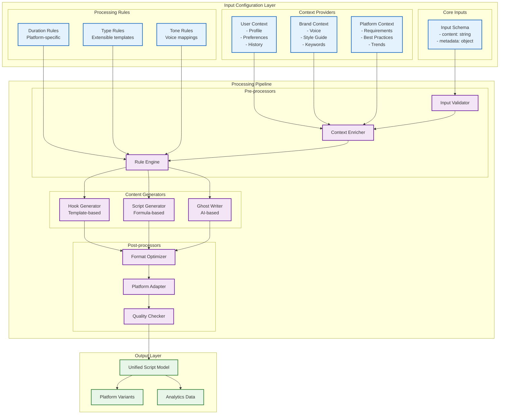

# Script Generation Migration Status

## Overview

Migrating from a tightly-coupled script generation system to a modular, maintainable architecture.

## Target Architecture

## Migration Progress

### ✅ Phase 1: Input Configuration Layer (COMPLETED)

**Implemented Components:**

1. **Core Input Schema** (`UnifiedScriptInput`)

   - Clean, unified input structure
   - No platform-specific logic
   - Type-safe interfaces

2. **Processing Rules**

   - Duration configuration centralized
   - Type definitions (speed, educational, viral)
   - Tone mappings (casual, professional, etc.)

3. **Context Providers**
   - User context with caching
   - Voice profile loading
   - Negative keywords support

**Key Files:**

- `/src/lib/script-generation/types.ts` - Unified types
- `/src/lib/script-generation/context-provider.ts` - Context caching
- `/src/lib/script-generation/duration-config.ts` - Duration rules
- `/src/lib/script-generation/unified-service.ts` - Main service

### 🚧 Phase 2: Processing Pipeline (IN PROGRESS)

**Next Implementation Tasks:**

#### Pre-processors (Not Started)

1. **Input Validator**

   - Schema validation
   - Business rule validation
   - Security checks

2. **Context Enricher**

   - Merge user/brand/platform contexts
   - Apply defaults
   - Handle overrides

3. **Rule Engine**
   - Apply duration rules
   - Select appropriate templates
   - Configure generation parameters

#### Content Generators (Partially Started)

1. **Hook Generator**

   - Template-based generation
   - Multiple hook styles
   - A/B testing support

2. **Script Generator**

   - Formula-based approach
   - Structured content blocks
   - Word count management

3. **Ghost Writer**
   - AI-powered generation
   - Context-aware content
   - Style adaptation

#### Post-processors (Not Started)

1. **Format Optimizer**

   - Clean output formatting
   - Remove redundancies
   - Ensure readability

2. **Platform Adapter**

   - Platform-specific formatting
   - Character limits
   - Special requirements

3. **Quality Checker**
   - Word count validation
   - Negative keyword filtering
   - Content quality metrics

### 📋 Phase 3: Output Layer (PLANNED)

1. **Unified Script Model**

   - Consistent output structure
   - Metadata enrichment
   - Version tracking

2. **Platform Variants**

   - Instagram optimization
   - TikTok formatting
   - YouTube Shorts adaptation

3. **Analytics Data**
   - Performance metrics
   - Usage patterns
   - Quality scores

## Benefits of New Architecture

1. **Modularity**: Each component has a single responsibility
2. **Extensibility**: Easy to add new generators, rules, or processors
3. **Maintainability**: Clear separation of concerns
4. **Testability**: Each component can be tested in isolation
5. **Debuggability**: Clear data flow makes issues easier to trace

## Current Testing

The test page at `/dashboard/test/script-generation` allows comparison between:

- V1: Original tightly-coupled system
- V2: New modular architecture (Phase 1 completed)

Performance improvements observed:

- Reduced database calls through caching
- Faster response times
- More consistent output quality
