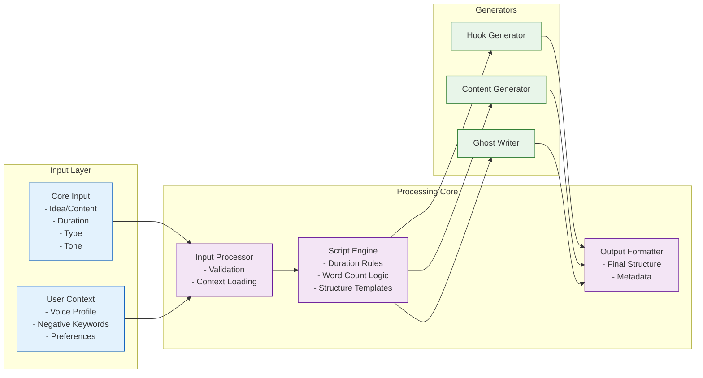

# Script Generation V2 Architecture

## System Overview

## Architecture Components

### Input Layer

- **Core Input**: Essential script generation parameters including idea/content, duration, type, and tone
- **User Context**: Personalization data including voice profile, negative keywords, and user preferences

### Processing Core

- **Input Processor**: Validates inputs and loads contextual data
- **Script Engine**: Applies duration rules, word count logic, and structure templates
- **Output Formatter**: Formats the final script structure with metadata

### Generators

- **Hook Generator**: Creates engaging opening hooks
- **Content Generator**: Produces main script content
- **Ghost Writer**: Handles AI-powered content generation

## Key Features

1. **Unified Input Schema**: Removes platform-specific logic
2. **Context Caching**: Reduces database calls
3. **Centralized Duration Configuration**: Consistent timing across all script types
4. **Modular Architecture**: Easy maintenance and extensibility
