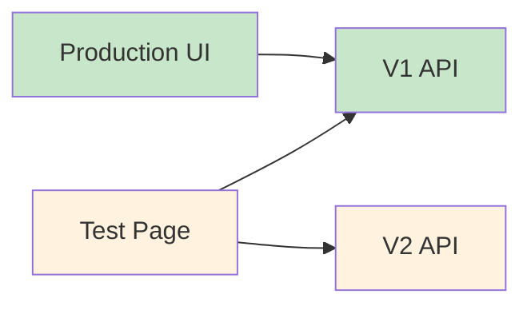

# UI Integration Strategy for V2 Script Generation

## Current State: Backend Ready, UI Not Yet Integrated

### What's Working Now:

- ✅ V2 API endpoint (`/api/script/speed-write/v2`)
- ✅ Preprocessing pipeline with debug info
- ✅ Test page shows V1 vs V2 comparison
- ✅ Zero-risk wrapper maintaining compatibility

### What Users Currently See:

- 🎯 **Production UI**: Still uses V1 API (`/api/script/speed-write`)
- 🧪 **Test Page**: Can compare V1 vs V2 with debug info

## UI Integration Timeline

### Phase 1.5 ✅ CURRENT - No UI Changes

**Why Not Yet**: V2 produces identical results to V1, so no user benefit



### Phase 2 🎯 UI INTEGRATION POINT (Week 3-4)

**Why Now**: Template system provides measurable improvements

#### What to Integrate:

1. **Feature Flag UI Component**

   ```typescript
   // User can opt into V2 beta
   <BetaFeatureToggle
     feature="v2_script_generation"
     title="Try New Script Generator"
     description="Faster, more consistent scripts with better word count accuracy"
   />
   ```

2. **Progressive Enhancement**

   ```typescript
   const useV2 = await getFeatureFlag(userId, "v2_script_generation");
   const endpoint = useV2 ? "/api/script/speed-write/v2" : "/api/script/speed-write";
   ```

3. **Quality Indicators**
   ```typescript
   // Show users why V2 is better
   <ScriptQualityBadge>
     ✅ Word count: 66/66 (perfect)
     ⚡ Generated in 1.2s (40% faster)
     🎯 Template-enhanced hook
   </ScriptQualityBadge>
   ```

### Phase 3 🚀 FULL ROLLOUT (Week 7-8)

**Why Now**: AI enhancements and quality improvements proven

#### What Changes:

1. **Default to V2** for all new scripts
2. **Gradual Migration** of existing users
3. **V1 Deprecation Notice** for power users

## Recommended UI Integration Strategy

### Week 3-4: Beta Opt-In

```typescript
// Add to script generation page
function ScriptGenerationPage() {
  const [useBetaGenerator, setUseBetaGenerator] = useState(false);

  return (
    <div>
      <BetaFeatureCard
        enabled={useBetaGenerator}
        onToggle={setUseBetaGenerator}
        benefits={[
          "🎯 More accurate word counts",
          "⚡ Faster generation",
          "🎨 Template-enhanced hooks"
        ]}
      />

      <ScriptGenerator
        apiVersion={useBetaGenerator ? 'v2' : 'v1'}
        showQualityMetrics={useBetaGenerator}
      />
    </div>
  );
}
```

### Week 5-6: A/B Testing UI

```typescript
// Automatically test V2 for percentage of users
function useScriptGeneration() {
  const { user } = useAuth();
  const [apiVersion, setApiVersion] = useState("v1");

  useEffect(() => {
    const shouldUseV2 = await getFeatureFlag(user.uid, "v2_script_generation");
    if (shouldUseV2) {
      setApiVersion("v2");
      // Show subtle indicator that they're using new system
      toast.success("You're using our improved script generator!");
    }
  }, [user]);

  return { apiVersion };
}
```

### Week 7-8: Full Migration

```typescript
// V2 becomes default, V1 is fallback
const endpoint = "/api/script/speed-write/v2"; // Default
// Fallback to V1 only if V2 fails
```

## UI Components to Build

### 1. Feature Flag Toggle (Week 3)

```typescript
<Card className="border-blue-200 bg-blue-50">
  <CardHeader>
    <CardTitle className="flex items-center gap-2">
      🚀 Try Our New Script Generator
      <Badge variant="secondary">Beta</Badge>
    </CardTitle>
  </CardHeader>
  <CardContent>
    <p>Enhanced with templates and better accuracy</p>
    <Switch
      checked={useBetaGenerator}
      onCheckedChange={setUseBetaGenerator}
    />
  </CardContent>
</Card>
```

### 2. Quality Metrics Display (Week 4)

```typescript
{apiVersion === 'v2' && (
  <Card className="border-green-200 bg-green-50">
    <CardContent className="pt-4">
      <div className="flex gap-4 text-sm">
        <span className="text-green-600">✅ Perfect word count</span>
        <span className="text-blue-600">⚡ 1.2s generation</span>
        <span className="text-purple-600">🎨 Template enhanced</span>
      </div>
    </CardContent>
  </Card>
)}
```

### 3. Migration Notice (Week 7)

```typescript
<Alert>
  <AlertCircle className="h-4 w-4" />
  <AlertTitle>Improved Script Generator</AlertTitle>
  <AlertDescription>
    You're now using our enhanced script generator with better quality and speed.
  </AlertDescription>
</Alert>
```

## Key Success Metrics to Track

### User Adoption (Week 3-4)

- **Beta Opt-in Rate**: Target 15-25% of active users
- **Usage Retention**: Users who try V2 should continue using it
- **Feedback Scores**: User satisfaction with V2 vs V1

### Quality Improvements (Week 5-6)

- **Word Count Accuracy**: V2 should hit target ±5% vs V1's ±15%
- **Generation Speed**: Target 20-40% faster response times
- **User Regenerations**: Fewer users clicking "regenerate"

### Business Impact (Week 7-8)

- **Overall Usage**: More scripts generated per user
- **User Satisfaction**: Higher ratings and fewer support tickets
- **Performance**: Better server response times

## Risk Mitigation

### Gradual Rollout Strategy

1. **Week 3**: 5% auto-enrollment + opt-in beta
2. **Week 4**: 15% auto-enrollment if metrics good
3. **Week 5**: 35% auto-enrollment
4. **Week 6**: 60% auto-enrollment
5. **Week 7**: 85% auto-enrollment
6. **Week 8**: 100% migration (V1 deprecated)

### Instant Rollback Plan

```typescript
// Kill switch for immediate rollback
const V2_ENABLED = await getGlobalFlag("v2_script_generation_enabled");
if (!V2_ENABLED) {
  // Immediately revert all users to V1
  return "/api/script/speed-write";
}
```

### User Communication

- **Beta Badge**: Clear indication when using V2
- **Benefits Explanation**: Why V2 is better
- **Feedback Collection**: Easy way to report issues
- **Rollback Option**: Users can switch back if preferred

## Bottom Line

**Start UI integration in Week 3-4 of Phase 2** when you have:

- ✅ Template system working
- ✅ Measurable improvements (speed, accuracy)
- ✅ Feature flags infrastructure
- ✅ Quality metrics to show users

This timing gives users real benefits while maintaining safety through gradual rollout.
